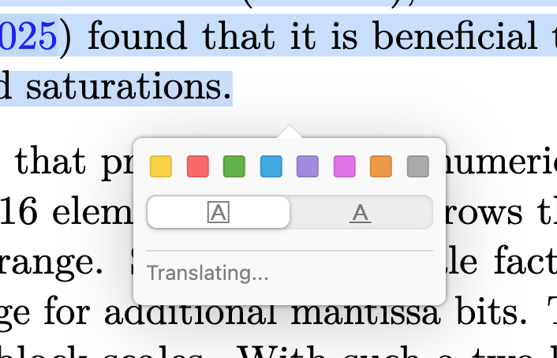
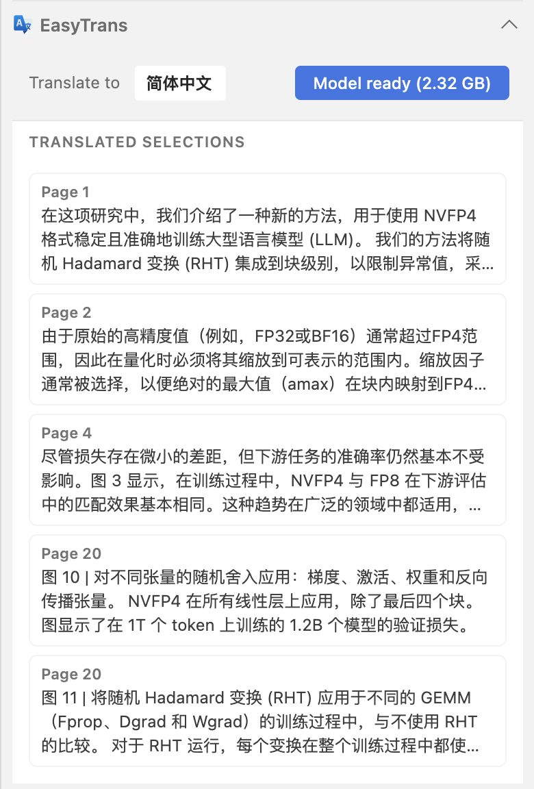
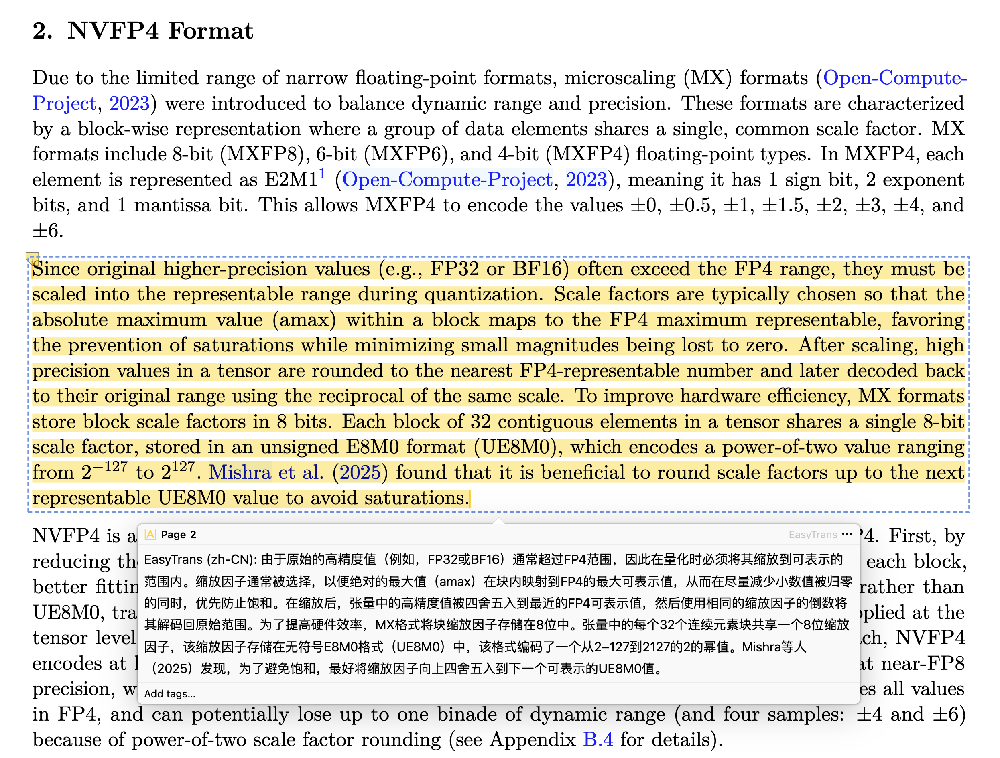
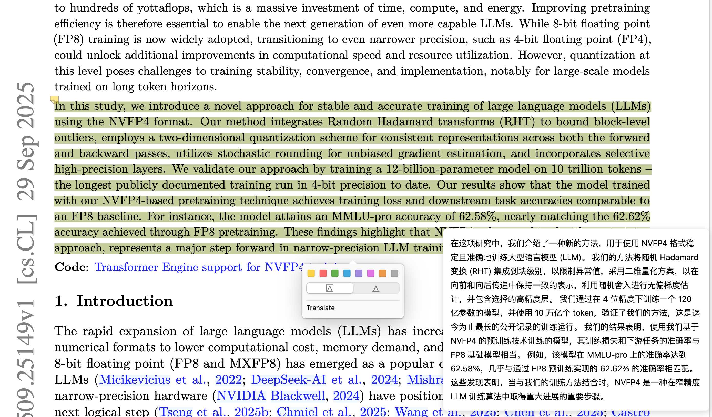

# Zotero EasyTrans

Zotero EasyTrans is a Zotero 8 plugin for offline translation of selected PDF text using the [TranslateGemma](https://blog.google/innovation-and-ai/technology/developers-tools/translategemma/) 4B on-device translation model.

## Screenshots

  

<em>Selection translate popup</em>

  

<em>EasyTrans panel</em>

  

<em>Highlight + translation note</em>

  

<em>Translation result bubble</em>

## What It Does
Translate selected text inside Zotero’s PDF reader and save the translation as an annotation.

## Why This Plugin
- Faster than switching to external translators while reading
- No text is uploaded (privacy-friendly)
- No online API dependency or costs

## Model
- [TranslateGemma](https://blog.google/innovation-and-ai/technology/developers-tools/translategemma/) 4B (GGUF), an on-device translation model from Google, running locally via llama.cpp

## Benefits
- Fully offline translation (model download is one-time)
- Keeps your data local
- Translations are saved as annotations for later review

## Supported Languages (Current)
English, Simplified Chinese, Traditional Chinese, Japanese, Korean, French, German, Spanish

## How To Use
1. Install `zotero-easytrans.xpi` in Zotero 8 (Tools → Add-ons → Install Add-on From File).
2. On first use, download the TranslateGemma 4B model (~2.5 GB).
3. Open a PDF item and select a target language in the `EasyTrans` panel.
4. Select text in the PDF, click `Translate`, and the translation will show and be saved as an annotation.
5. The panel lists all translated selections.

## License
MIT
